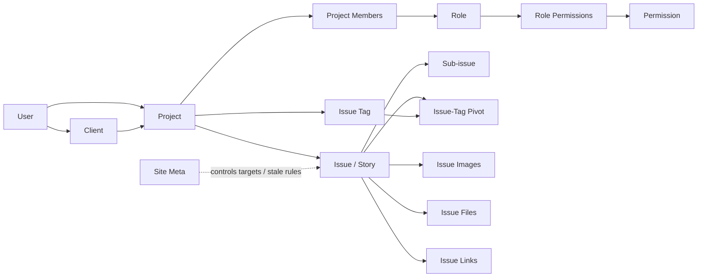
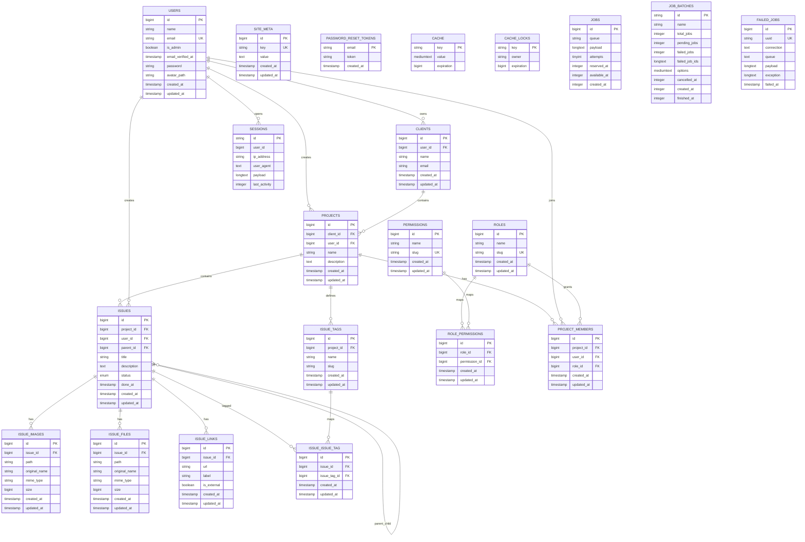
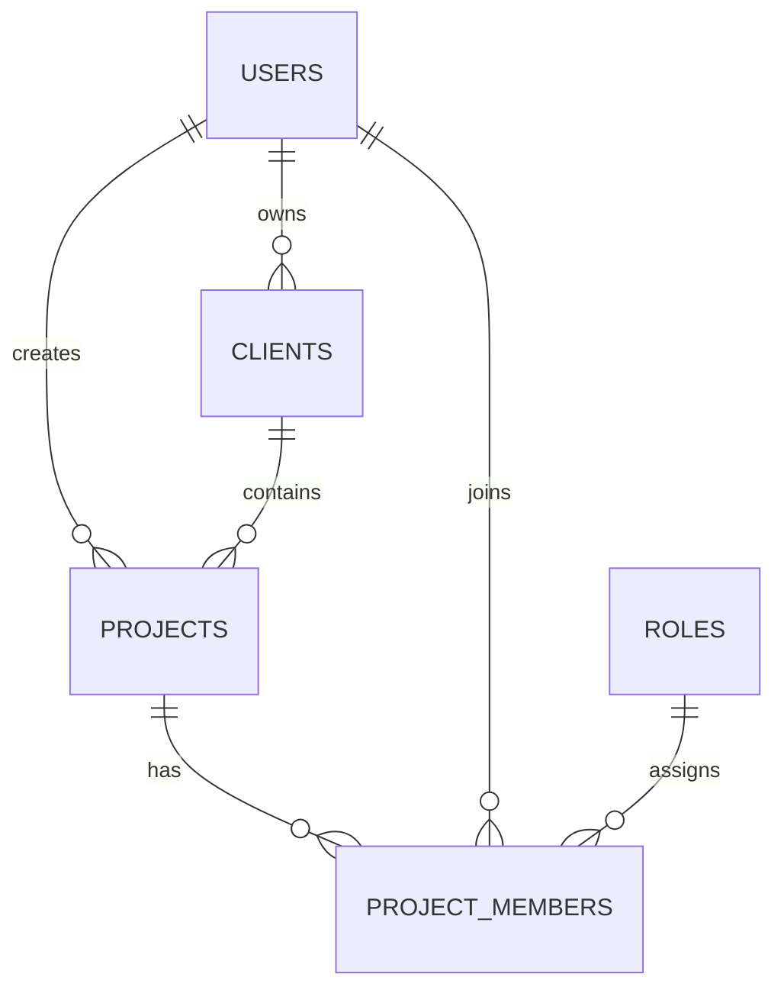
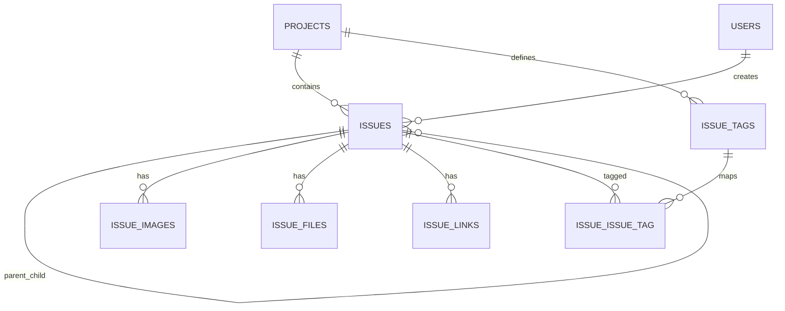

# Project ERD

This ERD is generated from the migration and seeding files currently in the repo. It is grouped by module so the structure is easier to read, while still calling out the primary keys, foreign keys, unique rules, and important indexes that drive data flow.

## Big Picture Flow

## Full ERD

## Module-Wise Notes

### 1. Identity and Access

| Entity | Key details | Important constraints |
| --- | --- | --- |
| `users` | Core actor table for admins, owners, developers, employees, and clients | `email` is unique |
| `roles` | Project-scoped role catalog | `slug` is unique |
| `permissions` | Action catalog such as `issue.create`, `project.edit`, `client.list` | `slug` is unique |
| `role_permissions` | Role-to-permission pivot | Unique on `role_id + permission_id`; both FKs use `restrictOnDelete()` |
| `project_members` | Connects a user to a project with one role | Unique on `project_id + user_id`; `role_id` is restricted on delete |

Seeded roles:

- `owner`
- `developer`
- `employee`
- `client`

Important RBAC behavior:

- Permissions are not attached directly to `users`.
- Access is resolved through `project_members -> role_id -> role_permissions -> permissions`.
- When a project is created, the creator is also inserted into `project_members` as `owner`.

### 2. Client and Project Structure

| Entity | Primary relationship | Important indexes |
| --- | --- | --- |
| `clients` | belongs to `users` via `user_id` | index on `user_id, name` |
| `projects` | belongs to `clients` and `users` | index on `user_id, client_id` |
| `project_members` | joins `projects`, `users`, and `roles` | indexes on `project_id`, `user_id`; unique on `project_id, user_id` |

Data flow:

1. A `user` creates or owns a `client`.
2. A `project` is created under that `client`.
3. The same project can then expose access to more `users` through `project_members`.
4. A project member’s role controls what they can do inside that project.

### 3. Issue and Story Module

| Entity | Purpose | Important constraints / indexes |
| --- | --- | --- |
| `issues` | Main story/task entity | index on `user_id, project_id, status`; index on `parent_id`; index on `done_at` |
| `issue_images` | Image attachments | index on `issue_id` |
| `issue_files` | File attachments | index on `issue_id` |
| `issue_links` | URL references | index on `issue_id` |
| `issue_tags` | Project-specific tags | unique on `project_id, slug`; index on `project_id` |
| `issue_issue_tag` | Many-to-many tag pivot | unique on `issue_id, issue_tag_id`; indexes on both FKs |

Story creation behavior:

1. A story starts as a row in `issues`.
2. It must belong to one `project`.
3. It may optionally point to another `issues.id` through `parent_id`.
4. Top-level stories have `parent_id = null`.
5. Sub-stories or subtasks point to a parent issue in the same project.
6. Tags are project-defined first in `issue_tags`, then linked through `issue_issue_tag`.
7. Images, files, and links are all dependent child rows of the issue.
8. `status` moves across `todo -> inprogress -> done`.
9. `done_at` is set only when the story becomes `done`, which supports daily activity and kanban metrics.

### 4. Site Settings and Support Tables

| Entity | Role in system |
| --- | --- |
| `site_meta` | Stores configurable values like `site_name`, daily target, and stale-day settings |
| `password_reset_tokens` | Password recovery |
| `sessions` | Auth session persistence |
| `cache`, `cache_locks` | Application cache and lock storage |
| `jobs`, `job_batches`, `failed_jobs` | Queue infrastructure |

## Delete / Integrity Rules That Matter

- Deleting a `user` cascades to owned `clients`, owned `projects`, and created `issues`.
- Deleting a `client` cascades to its `projects`.
- Deleting a `project` cascades to `issues`, `issue_tags`, and `project_members`.
- Deleting an `issue` cascades to `issue_images`, `issue_files`, `issue_links`, and tag pivot rows.
- Deleting a parent issue does not delete child issues directly; child `parent_id` becomes `null` because the FK uses `nullOnDelete()`.
- `roles` and `permissions` cannot be deleted while still referenced by pivot rows because those FKs use `restrictOnDelete()`.

## Practical Reading of “How Data Flows”

The business flow in this app is:

1. `users` create and manage `clients`.
2. `clients` own `projects`.
3. `projects` invite people through `project_members`.
4. `project_members` receive a `role`.
5. `roles` gain capability through `permissions`.
6. Once access exists, a user creates an `issue` inside a project.
7. That issue can become a parent story by receiving child issues through `parent_id`.
8. The story is enriched with tags, links, files, and images.
9. Progress reporting reads `status`, `done_at`, and timestamps to power kanban, daily activity, stale issue checks, and completion targets.

## Source Basis

This document is based on:

- `database/migrations/*.php`
- `database/seeders/DatabaseSeeder.php`
- `database/seeders/RolesAndPermissionsSeeder.php`
- Related model/controller behavior that clarifies story creation and project membership flow
