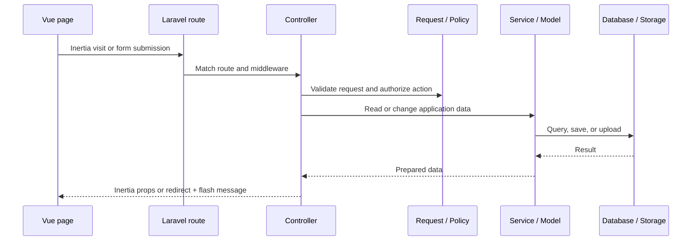

# Application-Wide Code Structure

This project is a Laravel + Vue 3 single-page application powered by Inertia. Laravel owns routing, authentication, validation, authorization, persistence, and server-side data shaping. Vue owns the interactive page experience.

```text
Browser
  -> Laravel route
    -> Controller
      -> Form Request / Policy / Service / Eloquent Model
        -> MySQL database or Laravel Storage
      -> Inertia response with page props
        -> Vue page, layout, and reusable components
```

## Root-level responsibilities

| Location | Purpose |
| --- | --- |
| `app/` | Laravel application code: controllers, models, requests, policies, services, and middleware. |
| `bootstrap/` | Laravel application bootstrapping and middleware aliases. |
| `config/` | Application and package configuration. |
| `database/migrations/` | Database schema history. |
| `database/seeders/` | Seed data, including roles and permissions. |
| `resources/js/` | Vue/Inertia frontend application. |
| `resources/views/` | Blade shell used by Inertia. |
| `routes/web.php` | Web routes and middleware boundaries. |
| `storage/` | Runtime files, logs, and public-disk issue uploads. |
| `public/` | Public web root and compiled assets. |
| `project-memory/` | Maintained project reference documentation and diagrams. |

## Backend structure (`app/`)

```text
app/
├── Http/
│   ├── Controllers/
│   │   ├── Admin/                 # Admin users, settings, roles, permissions
│   │   ├── Auth/                  # Login and logout session flow
│   │   ├── ClientController.php
│   │   ├── DashboardController.php
│   │   ├── IssueController.php
│   │   ├── ProfileController.php
│   │   ├── ProjectController.php
│   │   ├── ProjectMemberController.php
│   │   └── TagController.php
│   ├── Middleware/
│   │   └── HandleInertiaRequests.php
│   └── Requests/                  # Form validation and authorization
├── Models/                        # Eloquent relationships and access scopes
├── Policies/                      # Client, Project, and Issue authorization
├── Services/
│   ├── IssueService.php           # Reusable issue orchestration
│   └── RichTextSanitizer.php      # Safe rich-text HTML handling
└── Providers/                     # Laravel service providers
```

### Controllers

Controllers are grouped by responsibility. They accept a routed request, rely on Requests/Policies/Models/Services, then return an Inertia page or redirect with flash feedback.

- **Workspace:** `ClientController`, `ProjectController`, and `ProjectMemberController` manage client ownership, projects, and project membership.
- **Issue management:** `IssueController` manages issue lists, details, filters, Kanban, daily activity, attachments, links, status changes, and pins.
- **Discovery:** `DashboardController` supplies the workspace overview and activity data.
- **Access and profile:** `AuthenticatedSessionController` handles login/logout; `ProfileController` manages the authenticated user profile.
- **Administration:** controllers under `Controllers/Admin` manage users, site settings, roles, permissions, and role-permission assignments.

### Requests, Policies, and middleware

- Form Requests centralize validation for client, project, issue, profile, and admin-user submissions.
- Policies protect client, project, and issue actions according to ownership and project access.
- `auth` wraps all application routes except login.
- `admin` protects the `/admin/*` route group.
- `HandleInertiaRequests` shares authenticated-user details, navigation permissions, site settings, stale-work nudge counts, and flash messages with every Vue page.

### Models and services

Eloquent models represent the business schema documented in `ERD.md`: users, clients, projects, issues, tags, pins, files, images, links, roles, permissions, memberships, and site metadata.

`IssueService` holds reusable issue workflow logic so controller actions remain focused on HTTP concerns. `RichTextSanitizer` cleans formatted descriptions before they are stored or rendered.

## Frontend structure (`resources/js/`)

```text
resources/js/
├── Components/                    # Reusable UI building blocks
│   ├── Breadcrumbs.vue
│   ├── FlashToasts.vue
│   ├── FormError.vue
│   ├── IssueCard.vue
│   ├── IssueTree.vue
│   ├── Modal.vue
│   ├── Pagination.vue
│   ├── RichTextEditor.vue
│   ├── SkeletonCard.vue
│   └── StatusPill.vue
├── Layouts/
│   ├── AppLayout.vue               # Authenticated application shell/navigation
│   └── AdminLayout.vue             # Admin-specific shell/navigation
└── Pages/                          # Route-level Inertia pages
    ├── Admin/
    │   ├── Permissions/Index.vue
    │   ├── Roles/Index.vue
    │   ├── Settings/Index.vue
    │   └── Users/Index.vue
    ├── Auth/Login.vue
    ├── Clients/Index.vue
    ├── Issues/
    │   ├── DailyActivity.vue
    │   ├── Index.vue
    │   ├── Kanban.vue
    │   └── Show.vue
    ├── Profile/Show.vue
    ├── Projects/
    │   ├── Index.vue
    │   └── Show.vue
    ├── Tags/Index.vue
    └── Dashboard.vue
```

### Frontend conventions

- `Pages/` contains route-level screens and receives server-provided props from controllers.
- `Layouts/` provides persistent navigation, shared application context, and admin framing.
- `Components/` prevents repeated UI code: lists use `Pagination`, status display uses `StatusPill`, rich descriptions use `RichTextEditor`, and issue hierarchy uses `IssueTree`.
- Vue pages make Inertia visits/form submissions; Laravel returns the next page props or a redirect with flash feedback.

## Route organization

`routes/web.php` is organized by access boundary:

| Route area | Middleware | Main responsibility |
| --- | --- | --- |
| `/login` | `guest` | Session login. |
| `/dashboard`, `/profile` | `auth` | Workspace overview and personal settings. |
| `/clients`, `/projects`, `/projects/{project}/members` | `auth` | Workspace and membership management. |
| `/issues`, `/kanban`, `/tags` | `auth` | Issue lifecycle, board, activity, attachments, pins, and tags. |
| `/admin/*` | `auth`, `admin` | User, settings, role, and permission administration. |

## Common request flow



## Where to add new work

| If you are adding… | Primary location |
| --- | --- |
| A database field/table | `database/migrations/`, then the relevant model relationship/cast. |
| A new user action | Route -> controller action -> Request/Policy -> service/model -> Vue page/component. |
| A new screen | `resources/js/Pages/<Module>/`, paired with a controller Inertia response and route. |
| Shared UI | `resources/js/Components/`. |
| Shared application shell/navigation | `resources/js/Layouts/`. |
| Role-based control | Seed/migrate role or permission data, use policies and project membership checks. |
| Shared client-side context | `HandleInertiaRequests.php`. |

## Maintenance rule

When a feature changes the schema, page structure, or overall flow, update the corresponding files in `project-memory/`—especially `FEATURES.md`, `ERD.md`, and this document.
