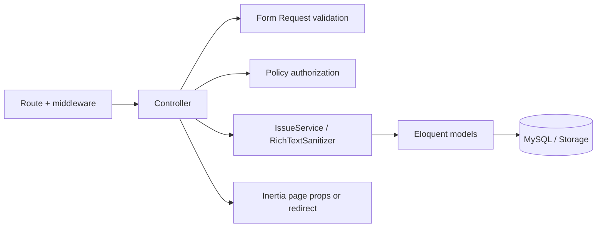

# Laravel Controllers and Models

This document explains the Laravel HTTP controllers and Eloquent models that drive the application.

## Controllers

| Controller | Main responsibilities | Primary routes / Vue response |
| --- | --- | --- |
| `DashboardController` | Builds workspace summary, analytics, and recent activity data. | `GET /dashboard` -> `Dashboard`. |
| `ClientController` | Lists, creates, updates, and deletes user-owned clients. | `/clients` -> `Clients/Index`. |
| `ProjectController` | Lists projects; creates, shows, updates, and deletes projects; supplies project-specific issue/member data. | `/projects` -> `Projects/Index`; `/projects/{project}` -> `Projects/Show`. |
| `ProjectMemberController` | Adds, updates, removes, and searches project members. | `/projects/{project}/members/*`. |
| `IssueController` | Core issue lifecycle: lists/filtering (including `tag_id` and `project_id`), Kanban, daily activity, create/update/delete, details, pinning, attachments, links, and policy-protected status changes. | `/issues` -> `Issues/Index`; `/issues/{issue}` -> `Issues/Show`; `/kanban` -> `Issues/Kanban`; `/issues/daily-activity` -> `Issues/DailyActivity`. |
| `TagController` | Lists, filters, creates, updates, and deletes project-scoped tags. | `/tags` -> `Tags/Index`. |
| `ProfileController` | Shows and updates the logged-in user profile and avatar. | `/profile` -> `Profile/Show`. |
| `Auth\AuthenticatedSessionController` | Shows login form, authenticates sessions, and logs users out. | `/login` -> `Auth/Login`; `POST /logout`. |
| `Admin\UserController` | Admin-only user listing and management. | `/admin/users` -> `Admin/Users/Index`. |
| `Admin\SiteSettingsController` | Admin-only site and issue-threshold settings. | `/admin/settings` -> `Admin/Settings/Index`. |
| `Admin\RoleController` | Admin-only role CRUD. | `/admin/roles` -> `Admin/Roles/Index`. |
| `Admin\PermissionController` | Admin-only permission CRUD. | `/admin/permissions` -> `Admin/Permissions/Index`. |
| `Admin\RolePermissionController` | Updates the permissions assigned to a role. | `PUT /admin/roles/{role}/permissions`. |

## Model map

| Model | Represents | Key relationships / behaviour |
| --- | --- | --- |
| `User` | Authenticated person: super admin, owner, developer, employee, or client. | Owns clients/projects/issues; participates in projects; exposes project-access helpers. |
| `Client` | A user-owned client workspace. | Belongs to a user; has many projects. |
| `Project` | A client project. | Belongs to client and creator; has issues; has members through `project_members`. |
| `ProjectMember` | Membership record assigning a user one project role. | Belongs to project, user, and role. |
| `Role` | Reusable project role, such as owner or developer. | Has many permissions through `role_permissions`; used by project members. |
| `Permission` | Named capability used by RBAC. | Belongs to many roles. |
| `Issue` | Main task/story entity. | Belongs to project and creator; may have a parent issue; has attachments/links; belongs to many tags; supports pins and completion tracking. |
| `IssueTag` | Project-scoped tag. | Belongs to project; belongs to many issues through `issue_issue_tag`. |
| `IssueImage` | Image attachment stored for an issue. | Belongs to issue. |
| `IssueFile` | File attachment stored for an issue. | Belongs to issue. |
| `IssueLink` | Internal or external reference link for an issue. | Belongs to issue. |
| `SiteMeta` | Key/value site configuration. | Supplies site name and issue target/stale thresholds. |

## Typical controller-to-model flow



## Important model relationships

```text
User -> Clients -> Projects -> Issues -> child Issues
                         |        |-> Images / Files / Links
                         |        |-> Tags (many-to-many)
                         |        |-> Pins (per user)
                         |-> Project Members -> Role -> Permissions
```

For database columns and cardinality, see `project-memory/ERD.md` and `project-memory/erd.png`.
