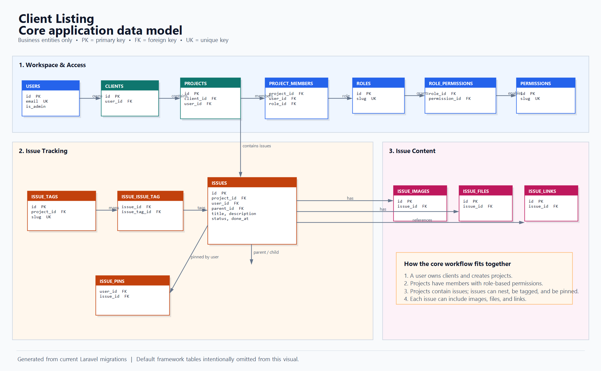
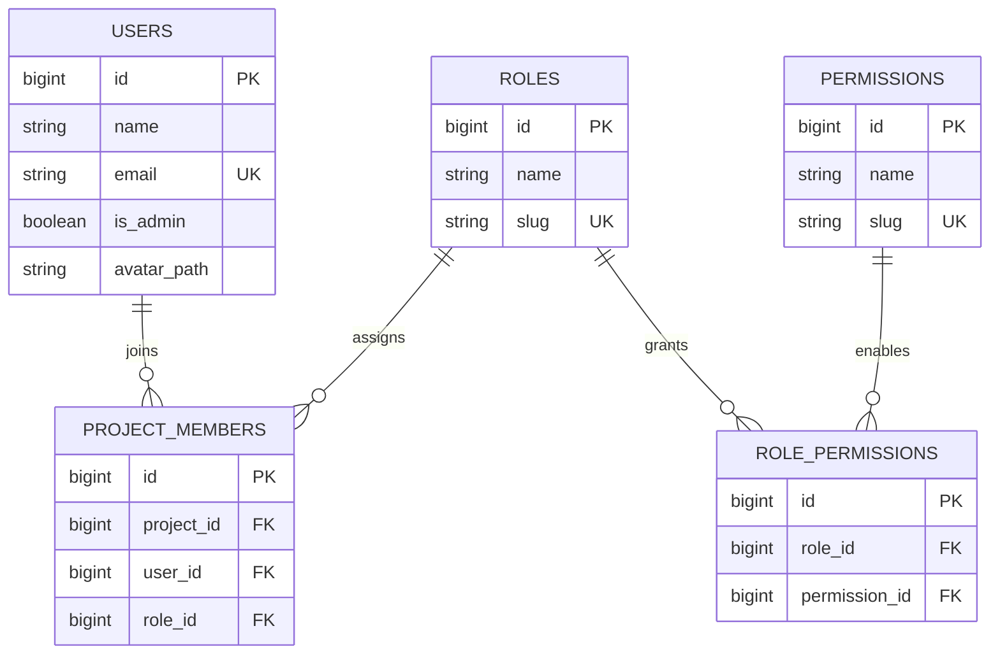
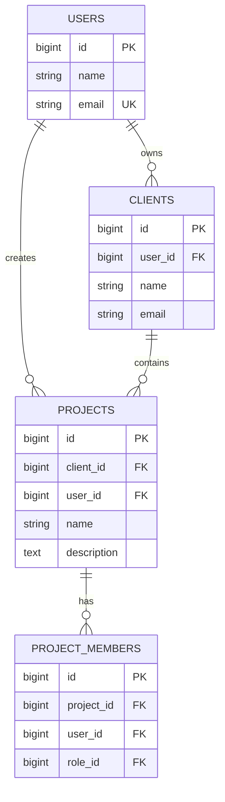
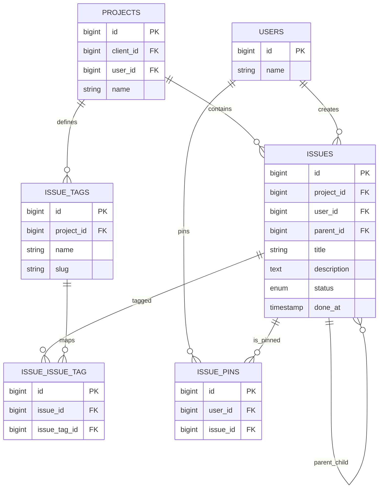
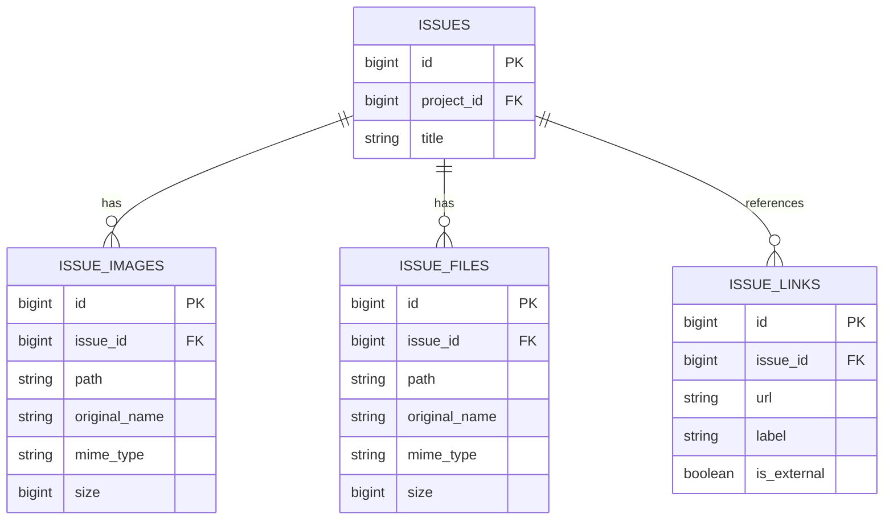
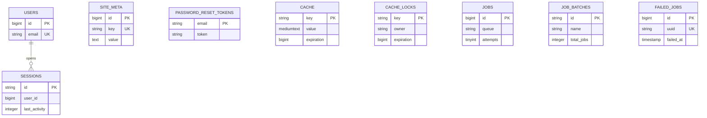

# Module-Wise Entity Relationship Diagram

This document maps the current Laravel migrations into logical modules. The `issue_pins` table is included alongside the earlier ERD so the diagram reflects the latest schema.

## 1. Identity and Project Access

## 2. Client and Project Workspace

## 3. Issues, Tags, and Pins

## 4. Issue Attachments and References

## 5. Application Support Tables

## Relationship and integrity notes

- `project_members` is unique per `project_id + user_id`; a member receives a role through `role_id`.
- `role_permissions` is unique per `role_id + permission_id`.
- `issue_tags` are project-scoped and unique per `project_id + slug`.
- `issue_issue_tag` is the many-to-many issue/tag pivot and is unique per `issue_id + issue_tag_id`.
- `issue_pins` is unique per `user_id + issue_id`.
- Deleting a project cascades to its issues, tags, and memberships. Deleting an issue cascades to its attachments, links, tags, and pins; child issues retain their row with `parent_id` set to `null`.
