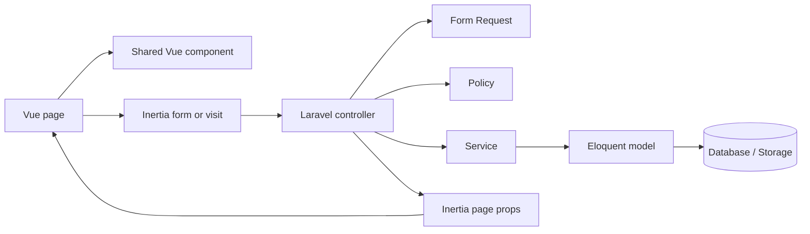

# Reusable Components and Laravel Building Blocks

This reference maps the reusable frontend and backend pieces to where they are currently used. It is based on the present imports and controller dependencies.

## Reusable Vue components

| Component | Purpose | Used by |
| --- | --- | --- |
| `AppLayout.vue` | Main authenticated shell: sidebar, top bar, breadcrumbs, shared flash messages, and page title. | Dashboard; Clients; Projects; Issues; Daily Activity; Kanban; Tags; Profile; Roles; Permissions. |
| `AdminLayout.vue` | Admin shell that composes `AppLayout`. | Admin Users and Admin Settings. |
| `Breadcrumbs.vue` | Breadcrumb trail inside the application shell. | Used by `AppLayout`. |
| `FlashToasts.vue` | Shows shared success/error flash messages from Laravel. | Used by `AppLayout`. |
| `FormError.vue` | Renders an Inertia form field error. | Login; Clients; Projects; Project Show; Issues Index/Show; Tags; Profile; Admin Users; Roles; Permissions; Settings. |
| `Modal.vue` | Reusable modal dialog. | Clients; Projects; Project Show; Issues Index/Show; Tags; Admin Users; Roles; Permissions. |
| `Pagination.vue` | Renders Laravel paginator links and metadata. | Clients; Projects; Project Show issues; Issues Index; Tags; Admin Users. |
| `RichTextEditor.vue` | TipTap rich-text input with editor toolbar and validation state. | Projects Index; Project Show issue creation; Issues Index; Issue Show editing and child-issue creation. |
| `StatusPill.vue` | Consistent Todo / In Progress / Done badge. | Dashboard; Project Show; Issues Index/Show; Daily Activity; `IssueCard`; `IssueTree`. |
| `IssueTree.vue` | Recursive nested issue/sub-issue tree. | Issue Show. |
| `SkeletonCard.vue` | Loading placeholder card. | Issues Index and Kanban. |
| `IssueCard.vue` | Reusable compact issue card with status badge. | Available for issue-card views; currently no direct page import was found. |

## Laravel services

| Service | Responsibility | Used by |
| --- | --- | --- |
| `IssueService` | Reusable issue workflow/orchestration logic, keeping issue controller actions focused on HTTP concerns. | Constructor-injected into `IssueController`. |
| `RichTextSanitizer` | Sanitizes stored rich HTML descriptions. | Constructor-injected into `IssueController` and `ProjectController`. |

## Form Requests

| Request | Validates / authorizes | Controller usage |
| --- | --- | --- |
| `ClientStoreRequest` | New client submissions. | `ClientController::store`. |
| `ClientUpdateRequest` | Client updates. | `ClientController::update`. |
| `ProjectStoreRequest` | New project submissions. | `ProjectController::store`. |
| `ProjectUpdateRequest` | Project updates. | `ProjectController::update`. |
| `IssueStoreRequest` | New top-level or child issue submissions, including issue content. | `IssueController::store`. |
| `IssueUpdateRequest` | Issue edits, status/content changes, attachments, links, and tags. | `IssueController::update`. |
| `ProfileUpdateRequest` | Logged-in user profile and avatar updates. | `ProfileController::update`. |
| `AdminUserStoreRequest` | Admin-created user submissions. | `Admin\UserController::store`. |
| `AdminUserUpdateRequest` | Admin user updates. | `Admin\UserController::update`. |
| `AdminSiteSettingsUpdateRequest` | Site name and issue-target/stale-rule settings. | `Admin\SiteSettingsController::update`. |

## Policies and authorization

| Policy | Protects | Used by |
| --- | --- | --- |
| `ClientPolicy` | Client listing and client create/update/delete actions. | `ClientController` calls Laravel authorization methods before returning or mutating client data. |
| `ProjectPolicy` | Project viewing, updates, deletion, and membership management. | `ProjectController` and `ProjectMemberController`. |
| `IssuePolicy` | Issue creation, viewing, updating, deletion, attachment deletion, and status changes. | `IssueController`. |

Policy registration is handled in `app/Providers/AppServiceProvider.php`. In addition, the `admin` middleware protects the `/admin/*` route group.

## Shared request context

`app/Http/Middleware/HandleInertiaRequests.php` supplies every Inertia page with:

- authenticated user profile data and avatar URL;
- navigation-level access flags for projects, clients, and tags;
- site name and stale/critical issue thresholds;
- stale-work and critical-work nudge counters; and
- success/error flash messages.

This is why pages and layouts can read shared data without each controller rebuilding the same context.

## Reuse flow

## When to reuse vs. create

- Use an existing component when the visual pattern and interaction are already the same—for example, use `Modal`, `Pagination`, `FormError`, and `StatusPill` rather than recreating them in a page.
- Use a Form Request for a repeated or meaningful write operation instead of placing detailed validation directly in a controller.
- Put cross-action workflow logic in a service when it is not specific to a single HTTP endpoint.
- Add to a policy when the rule decides whether a user may act on a specific client, project, or issue.
