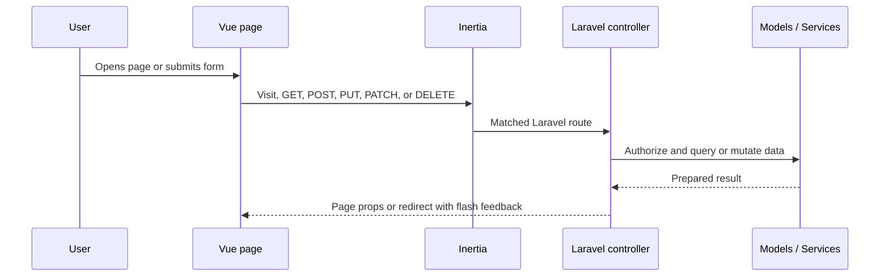

# Vue Pages Used Project-Wide

All frontend pages live in `resources/js/Pages/`. Laravel controllers return them through Inertia, and each page uses `AppLayout` or `AdminLayout` where appropriate.

## Main application pages

| Vue page | Route | Controller | Purpose |
| --- | --- | --- | --- |
| `Dashboard.vue` | `/dashboard` | `DashboardController@index` | Workspace overview, issue analytics, status summaries, and activity information. |
| `Clients/Index.vue` | `/clients` | `ClientController@index` | Paginated client listing with create/edit/delete modal flows. |
| `Projects/Index.vue` | `/projects` | `ProjectController@index` | Project listing, filtering, and create/edit workflows. |
| `Projects/Show.vue` | `/projects/{project}` | `ProjectController@show` | Project overview, issue list/date column, quick read, member management, and issue creation. |
| `Issues/Index.vue` | `/issues` | `IssueController@index` | Filterable, searchable, paginated issue listing and create-issue modal. |
| `Issues/Show.vue` | `/issues/{issue}` | `IssueController@show` | Full issue detail, editing, rich text, tags, uploads, links, image gallery, related issues, and sub-issue tree. |
| `Issues/Kanban.vue` | `/kanban` | `IssueController@kanban` | Status-board workflow for Todo, In Progress, and Done issues. |
| `Issues/DailyActivity.vue` | `/issues/daily-activity` | `IssueController@dailyActivity` | Date-focused created/completed issue activity and heatmap view. |
| `Tags/Index.vue` | `/tags` | `TagController@index` | Project-scoped tag management with filtering, pagination, and create/edit modals. |
| `Profile/Show.vue` | `/profile` | `ProfileController@show` | Logged-in user profile and avatar updates. |
| `Auth/Login.vue` | `/login` | `AuthenticatedSessionController@create` | Guest login screen. |

## Administration pages

| Vue page | Route | Controller | Purpose |
| --- | --- | --- | --- |
| `Admin/Users/Index.vue` | `/admin/users` | `Admin\UserController@index` | Admin user management. |
| `Admin/Settings/Index.vue` | `/admin/settings` | `Admin\SiteSettingsController@index` | Site name and issue target/stale/critical settings. |
| `Admin/Roles/Index.vue` | `/admin/roles` | `Admin\RoleController@index` | Role management and permission assignment. |
| `Admin/Permissions/Index.vue` | `/admin/permissions` | `Admin\PermissionController@index` | Permission management. |

## Layout usage

| Layout | Used for |
| --- | --- |
| `AppLayout.vue` | The main authenticated shell used across workspace, project, issue, tag, profile, dashboard, and RBAC pages. It provides navigation, breadcrumbs, flash toasts, and shared app context. |
| `AdminLayout.vue` | A thin admin wrapper around `AppLayout`, used by Admin Users and Admin Settings. |
| No authenticated layout | `Auth/Login.vue`, because it is a guest-only entry screen. |

## Page-level data flow

## Page conventions

- Index pages own list filters, paginated data, and create/edit modal state.
- Show pages own detail-level actions and compose reusable components such as `StatusPill`, `RichTextEditor`, `IssueTree`, and `Modal`.
- The Dashboard, Kanban, and Daily Activity pages focus on different views of the same issue data.
- Admin pages are protected by the Laravel `admin` middleware; all other workspace pages require authentication and their underlying policy/access checks.
